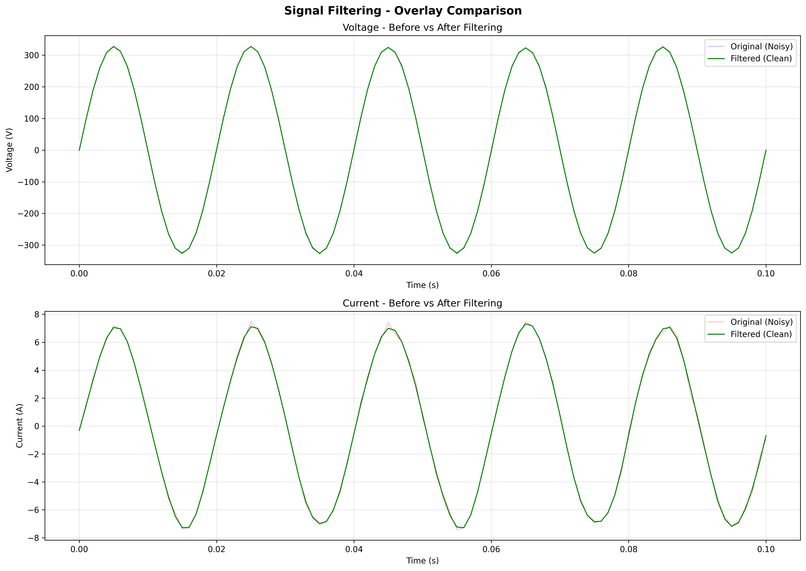
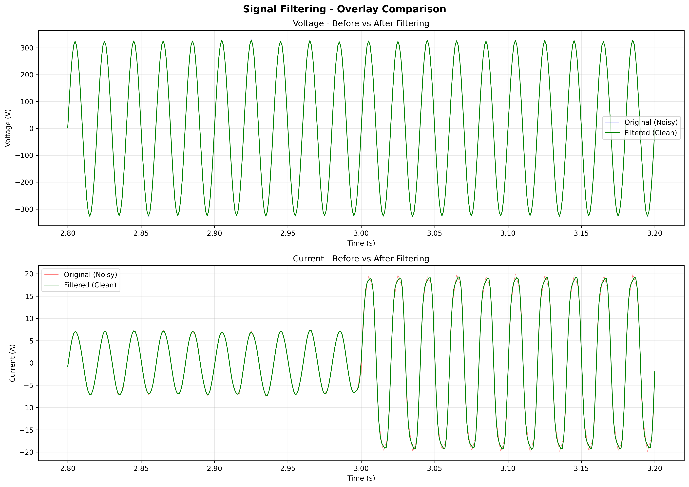

# DSP Fiesta Power Monitoring System

A Digital Signal Processing (DSP)-based power monitoring and anomaly detection system.

## Overview
This project analyzes voltage and current waveforms using core DSP techniques to identify abnormal power usage and illegal electricity tapping.

## Setup
1. Create a virtual environment:
   ```bash
   python3 -m venv venv
   source venv/bin/activate
   ```
2. Install dependencies:
   ```bash
   pip install -r requirements.txt
   ```

## Data Generation
To generate synthetic power signal datasets (normal load and illegal tapping scenarios):
```bash
python src/generate_data.py
```
This will create the following files in the `data/` directory:
- `normal_load.csv`: Simulated normal power usage.
- `illegal_tap.csv`: Simulated illegal tapping with amplitude changes and harmonic distortion.

## Signal Visualization
To visualize electrical signal waveforms in the time domain:

### Basic Usage
```bash
python src/visualize_signal.py data/normal_load.csv
```

### Advanced Options
```bash
# Save plot to file
python src/visualize_signal.py data/normal_load.csv --save output.png

# Visualize specific time range (e.g., 0-2 seconds)
python src/visualize_signal.py data/illegal_tap.csv --time-range 0 2

# Custom title
python src/visualize_signal.py data/illegal_tap.csv --title "Illegal Tap Detection"

# Combined options
python src/visualize_signal.py data/illegal_tap.csv --time-range 2 5 --save tap_analysis.png --title "Tap Event (2-5s)"
```

### Features
- **Time-Domain Visualization**: Plots both voltage and current waveforms against time
- **Sampling Frequency Display**: Shows the sampling frequency (fs = 1000 Hz) in the plot
- **Clear Transitions**: Time-domain transitions are clearly visible (e.g., illegal tap starting at t=3s)
- **Flexible Time Range**: Zoom into specific time intervals for detailed analysis

## FFT & Frequency-Domain Analysis
Transform time-domain signals into frequency domain using Fast Fourier Transform (FFT) to identify harmonic content and spectral distortion.

### Basic Usage
```bash
# Analyze frequency spectrum of a single signal
python src/fft_analysis.py data/normal_load.csv
## RMS & Power Feature Extraction
Extract Root Mean Square (RMS) and power metrics from electrical signals to detect anomalies and illegal tapping.

### Mathematical Formulas

#### RMS (Root Mean Square)
The RMS value represents the effective value of an AC signal:

- **RMS Voltage:**  
  ```
  V_rms = √(1/N × Σ(V²))
  ```
  where V is the instantaneous voltage and N is the number of samples

- **RMS Current:**  
  ```
  I_rms = √(1/N × Σ(I²))
  ```
  where I is the instantaneous current and N is the number of samples

#### Power Calculations
- **Instantaneous Power:**  
  ```
  P(t) = V(t) × I(t)
  ```
  Power at each time instant

- **Average Power:**  
  ```
  P_avg = 1/N × Σ(P(t)) = 1/N × Σ(V(t) × I(t))
  ```
  Mean power over the entire signal duration

### Usage

#### Analyze a Single File
```bash
python src/feature_extraction.py data/normal_load.csv
```

#### Compare Normal Load vs Illegal Tap
```bash
python src/feature_extraction.py --compare
```

### Output Metrics
The feature extraction tool computes and displays:
- **RMS Voltage (V)**: Effective voltage value
- **RMS Current (A)**: Effective current value  
- **Average Power (W)**: Mean power consumption
- **Max/Min Power (W)**: Peak power values
- **Percentage Change**: Comparison between normal and anomalous scenarios

### Detection Capability
The system successfully detects illegal electricity tapping by identifying:
- Elevated RMS current (typically >100% increase)
- Elevated average power (typically >100% increase)
- Anomaly alerts when power increase exceeds 50% threshold
## Digital Noise Filtering
Apply low-pass Butterworth filter to remove high-frequency noise from electrical signals while preserving the fundamental frequency and harmonics.

### Examples
Visual demonstrations of noise filtering effectiveness:

**Normal Load (Zoomed: 0-0.1s)**

*The filtered signal (green) is visibly smoother than the noisy original (light), clearly showing noise reduction while preserving the 50 Hz sinusoidal waveform.*

**Illegal Tap Transition (2.8-3.2s)**

*The filter removes noise while preserving the important transition at t=3s where the illegal tap event occurs. Note the current amplitude change is maintained.*

### Basic Usage
```bash
# Apply filter and display interactive plots
python src/apply_filter.py data/normal_load.csv

# Filter with custom cutoff frequency
python src/apply_filter.py data/normal_load.csv --cutoff 150
```

### Advanced Options
```bash
# Analyze voltage signal (default is current)
python src/fft_analysis.py data/normal_load.csv --signal voltage

# Compare normal load vs illegal tap spectra
python src/fft_analysis.py data/normal_load.csv --compare data/illegal_tap.csv

# Display harmonic analysis table using pandas
python src/fft_analysis.py data/illegal_tap.csv --show-harmonics

# Set frequency range limit (e.g., 0-500 Hz)
python src/fft_analysis.py data/illegal_tap.csv --xlim 500

# Save plot to file
python src/fft_analysis.py data/normal_load.csv --compare data/illegal_tap.csv --save spectrum_comparison.png

# Combined: Compare with harmonics table
python src/fft_analysis.py data/normal_load.csv --compare data/illegal_tap.csv --show-harmonics --xlim 300
```

### Features
- **FFT Computation**: Computes Fast Fourier Transform of voltage/current signals
- **Frequency Spectrum Plotting**: Visualizes magnitude spectrum with frequency bins
- **Harmonic Analysis**: Identifies and quantifies fundamental frequency (50 Hz) and harmonics using pandas DataFrames
- **Spectral Comparison**: Side-by-side comparison of normal vs illegal tap signals
- **Automatic Peak Detection**: Annotates significant frequency components
- **Distortion Detection**: Clear visualization of 3rd and 5th harmonics in illegal tap scenarios

### Key Observations
- **Normal Load**: Shows clean fundamental frequency (50 Hz) with minimal harmonics (<0.1%)
- **Illegal Tap**: Exhibits clear spectral distortion with:
  - **3rd Harmonic (150 Hz)**: ~11-12% of fundamental magnitude
  - **5th Harmonic (250 Hz)**: ~5-6% of fundamental magnitude
  - These harmonics indicate non-linear loads typical of illegal tapping with electronic devices
# Save filtered data to CSV
python src/apply_filter.py data/normal_load.csv --output data/normal_load_filtered.csv

# Save before/after comparison plots
python src/apply_filter.py data/illegal_tap.csv --save-plot filtered_analysis.png

# Focus on specific time range (e.g., around illegal tap transition)
python src/apply_filter.py data/illegal_tap.csv --time-range 2.5 4.5 --save-plot tap_filtered.png

# Custom filter parameters
python src/apply_filter.py data/normal_load.csv --cutoff 200 --order 6

# Choose plot type (comparison, overlay, or both)
python src/apply_filter.py data/normal_load.csv --plot overlay --save-plot overlay.png
```

### Filter Parameters
- **`--cutoff`**: Cutoff frequency in Hz (default: 200 Hz)
  - Frequencies above this are attenuated
  - For 50 Hz power signals, 200 Hz preserves fundamental + harmonics while removing noise
- **`--order`**: Filter order (default: 4)
  - Higher order = sharper cutoff but more computational cost
  - Order 4 provides good balance between smoothness and phase preservation
- **`--plot`**: Plot type - `comparison` (side-by-side), `overlay` (before/after overlaid), or `both` (default)
- **`--output`**: Save filtered signal data to CSV file
- **`--save-plot`**: Save plots to image file instead of displaying

### Features
- **Low-Pass Butterworth Filter**: Smooth frequency response with minimal passband ripple
- **Zero-Phase Filtering**: Uses `filtfilt` to avoid phase distortion in the filtered signal
- **Noise Reduction Metrics**: Displays standard deviation of removed noise
- **Before/After Visualization**: Side-by-side comparison and overlay plots
- **Preserves Signal Characteristics**: Maintains important features like illegal tap transitions while removing noise
